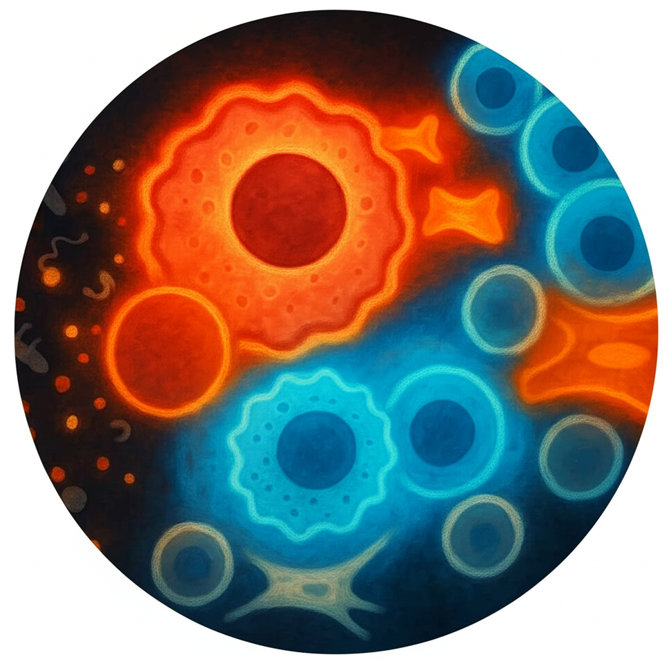

---
---

# **Exploring the Mechanisms of Immune Recognition at Cellular and Organismal Interfaces**

  

## Highlights
<!--
### 2025


Our study on cross-species immune sensor adaptation was published in *Nature Immunology*, revealing conserved mechanisms across mammals and birds.






---
-->

### 2024


Our lab officially opened at UConn Health! We're excited to start recruiting and collaborating.






